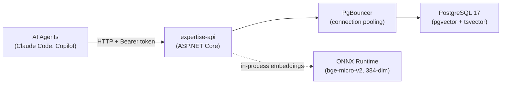

# agent-expertise-api

[](https://github.com/TheSemicolon/agent-expertise-api/actions/workflows/ci.yml)
[](https://github.com/TheSemicolon/agent-expertise-api/actions/workflows/release.yml)

Self-hosted .NET 10 REST API for storing and serving expertise entries consumed by AI agents. Entries are a running log of issues/fixes, workarounds, caveats, and requirements — either domain-specific or shared across agent domains.

## Architecture



## Tech Stack

| Component | Technology |
|-----------|-----------|
| Runtime | .NET 10 (LTS) |
| Framework | ASP.NET Core Minimal APIs |
| Database | PostgreSQL 17 + pgvector + tsvector |
| Connection pooling | PgBouncer 1.21+ (transaction mode) |
| Embeddings | In-process ONNX (bge-micro-v2, 384-dim) |
| Data access | EF Core (repository pattern) |
| API docs | Scalar (OpenAPI) |
| Local dev | Docker Compose |
| CI/CD | GitHub Actions (build + push to GHCR) |

## API Surface

| Method | Endpoint | Purpose |
|--------|----------|---------|
| GET | `/expertise` | List/filter entries by domain, tags, type, severity (Approved only) |
| GET | `/expertise/{id}` | Get single entry (Approved only) |
| GET | `/expertise/drafts` | List Draft + Rejected entries in caller's tenant (requires `expertise.write.approve`) |
| POST | `/expertise` | Create entry (generates embedding, writes audit row) |
| POST | `/expertise/batch` | Create up to 100 entries (generates embeddings, deduplicates) |
| PATCH | `/expertise/{id}` | Update entry. Approved entries regress to Draft if caller lacks `write.approve` |
| DELETE | `/expertise/{id}` | Soft delete (sets DeprecatedAt). Shared entries require `expertise.write.approve` |
| POST | `/expertise/{id}/approve` | Transition Draft → Approved (requires `expertise.write.approve`) |
| POST | `/expertise/{id}/reject` | Transition Draft → Rejected with required reason (requires `expertise.write.approve`) |
| GET | `/expertise/search?q=` | Keyword full-text search (tsvector, Approved only) |
| GET | `/expertise/search/semantic?q=` | Semantic vector search (pgvector, Approved only) |
| GET | `/audit` | Cross-tenant audit log (cursor-paginated, requires `expertise.admin`) |
| GET | `/health/live` | Liveness — 200 while the process responds; no dependency checks. Map this to k8s `livenessProbe` and `systemd WatchdogSec=`. No auth. |
| GET | `/health/ready` | Readiness — 200 only when DB, ONNX model, and pending-migration checks are all healthy; 503 otherwise. Map this to k8s `readinessProbe` and load-balancer health checks. No auth. |
| GET | `/health` | Back-compat alias for `/health/ready`. No auth. |
| GET | `/metrics` | Prometheus scrape endpoint (no auth required) |
| GET | `/query` | Interactive query page (read-only, no auth to load) |

All endpoints except `/health`, `/health/live`, `/health/ready`, `/query`, and `/metrics` require `Authorization: Bearer <token>` — a JWT (`Auth:Mode = Oidc`) or, in Development, an API key or LocalDev token (`Auth:Mode = Hybrid`). See [SKILL.md](.claude/skills/expertise-api-design/SKILL.md) for scopes, modes, and configuration.

## Quick Start

```bash
# 1. Start the database
cp deploy/local/.env.example deploy/local/.env
# Edit deploy/local/.env — set POSTGRES_PASSWORD and AUTH__APIKEY
docker compose -f deploy/local/docker-compose.yml up -d postgres pgbouncer

# 2. Restore the EF Core CLI tool (pinned in .config/dotnet-tools.json)
dotnet tool restore

# 3. Apply migrations
dotnet ef database update --project src/ExpertiseApi

# 3b. Download ONNX model files (required for embeddings and semantic search)
./scripts/download-models.sh

# 4. Run the API
dotnet run --project src/ExpertiseApi

# 5. Verify
curl http://localhost:5000/health

# 6. Browse the query page (interactive UI for search and filtering)
# http://localhost:5000/query
```

See [CLAUDE.md](CLAUDE.md) for full build commands, curl examples, and development guide.

## Deployment

A Helm chart is included at `helm/expertise-api/` for deploying to Kubernetes (k3s or any k8s cluster). The chart includes PostgreSQL and PgBouncer. Backup is handled out-of-chart by a sidecar deployed from the infrastructure repo.

```bash
# Example deploy
helm upgrade --install expertise-api ./helm/expertise-api \
  -f my-values.yaml \
  --namespace expertise-api \
  --create-namespace
```

### External Postgres (managed or pre-existing)

Set `postgres.enabled: false` to skip the in-chart Postgres StatefulSet and PgBouncer sidecar. Use this with Azure Database for PostgreSQL Flexible Server, RDS, Cloud SQL, or any existing Postgres reachable from the cluster.

When disabled, the operator must supply `ConnectionStrings__DefaultConnection` (and a writeable database with the `vector` extension installed) in the secret named by `auth.secretName`:

```yaml
# my-values.yaml
postgres:
  enabled: false
  external:
    # Optional but RECOMMENDED when networkPolicy.enabled=true: CIDR of the
    # external Postgres host(s) so the API NetworkPolicy emits an explicit
    # ipBlock egress rule. Without this, you must either disable the
    # NetworkPolicy entirely or supply custom egress rules.
    cidr: "10.20.0.0/16"
    port: 5432   # optional, defaults to 5432
networkPolicy:
  # Safe to leave enabled when postgres.external.cidr is set above.
  enabled: true
auth:
  mode: Oidc
  secretName: expertise-api-app   # must contain ConnectionStrings__DefaultConnection
  oidc:
    issuers:
      - name: Entra
        issuer: "https://login.microsoftonline.com/{tenant-id}/v2.0"
        audience: "{api-client-id}"
```

Azure Database for PostgreSQL Flexible Server connection-string shape (in the Secret pointed to by `auth.secretName`):

```text
ConnectionStrings__DefaultConnection=Host={server}.postgres.database.azure.com;Port=5432;Database=expertise;Username={user};Password={password};SSL Mode=Require;Trust Server Certificate=true
```

Docker images are published to GHCR when a release is cut from `main`:

```text
ghcr.io/thesemicolon/agent-expertise-api:latest          # most recent stable release
ghcr.io/thesemicolon/agent-expertise-api:v1.2.3          # immutable SemVer tag
ghcr.io/thesemicolon/agent-expertise-api:1.2             # tracks the latest 1.2.x
```

The Helm chart is also published as an OCI artifact on every release:

```bash
helm install expertise-api oci://ghcr.io/thesemicolon/charts/expertise-api \
  --version X.Y.Z \
  --namespace expertise-api --create-namespace \
  -f my-values.yaml
```

The chart version equals the application version (e.g. `0.4.2` chart serves the `v0.4.2` image by default).

### Supply-chain verification (cosign keyless OIDC)

Both the image and the chart artifact are signed via Sigstore keyless OIDC (the workflow's GitHub Actions OIDC token, no long-lived keys). Verify before installing:

```bash
# Verify image
cosign verify ghcr.io/thesemicolon/agent-expertise-api:vX.Y.Z \
  --certificate-identity-regexp 'https://github\.com/TheSemicolon/agent-expertise-api/\.github/workflows/release\.yml@refs/heads/main' \
  --certificate-oidc-issuer https://token.actions.githubusercontent.com

# Verify chart artifact
cosign verify ghcr.io/thesemicolon/charts/expertise-api:X.Y.Z \
  --certificate-identity-regexp 'https://github\.com/TheSemicolon/agent-expertise-api/\.github/workflows/release\.yml@refs/heads/main' \
  --certificate-oidc-issuer https://token.actions.githubusercontent.com
```

A missing or invalid signature exits non-zero — wire it into your deploy pipeline as a hard gate.

### Archetype A2: native OS service install (no Docker)

For a single developer who wants the API always-on without the Docker
Desktop VM tax (~2 GB RAM idle on macOS / Windows), `scripts/install.sh`
(macOS + Linux + WSL) and `scripts/install.ps1` (Windows) install the API
as a native OS service:

- **Linux**: systemd `--user` unit, `Type=notify`, sandboxed
  (`ProtectSystem=strict`, `ProtectHome=read-only`, `PrivateTmp`, etc.)
- **macOS**: launchd `LaunchAgent` (per-user), `KeepAlive { Crashed = true }`
- **Windows**: Windows Service via `sc.exe` with Virtual Account
  `NT SERVICE\expertise-api`, failure recovery 5s/5s/30s

**Graceful stop budgets** (#142): the host configures
`HostOptions.ShutdownTimeout = 30s` to drain in-flight HTTP, close the
Npgsql pool, and dispose the ONNX session before the service manager
escalates to SIGKILL. The systemd unit (`TimeoutStopSec=45`) and the launchd
plist (`ExitTimeOut=45`) add a 15s OS-level margin on top — stop the service
and the .NET host has 30s to drain, after which systemd/launchd will fire
SIGKILL at the 45s mark.

**Schema migrations on install/upgrade** (#144): both install scripts run
`scripts/migrate.{sh,ps1}` between publish and service start. The migrate
step invokes the bundled `ExpertiseApi migrate` verb, which applies any
pending EF Core migrations and is idempotent (no-op when up to date).

- On a **fresh install** the secrets file has not yet been edited, so the
  install script detects the placeholder connection string and **skips**
  migrate with a warning. After editing `~/.config/expertise-api/secrets.env`
  (or `%ProgramData%\ExpertiseApi\config\secrets.env` on Windows), run
  `scripts/migrate.sh` (or `.\scripts\migrate.ps1`) manually, then start
  the service.
- On an **upgrade** the secrets file is preserved and migrate runs to
  completion. Migrate failure is fatal: the install script exits non-zero,
  the service is **not** restarted, and the prior binary keeps serving.
- The migrate scripts are safe to run standalone any time; they exit 0 on
  no-op so they're cheap to wire into other automation.

> **Upgrade note** for installs that predate #144: pre-existing `secrets.env`
> files generated by earlier installs may have the connection string
> **unquoted** (`ConnectionStrings__DefaultConnection=Host=...;Port=...;...`).
> The bash sourcer splits on `;` and only retains the first segment, which
> would silently truncate the connection string. The new install script
> detects this and aborts with an explicit remediation message; quote the
> value (`ConnectionStrings__DefaultConnection="Host=...;Port=...;..."`) and
> re-run the installer.

Quick start (macOS / Linux / WSL):

```bash
./scripts/install.sh                              # per-user install, fdd publish
edit ~/.config/expertise-api/secrets.env          # set ConnectionStrings__DefaultConnection
./scripts/migrate.sh                              # apply EF Core migrations (idempotent)
./scripts/expertise-apictl status                 # daily-use service control
./scripts/expertise-apictl logs -f                # follow logs (journald / launchd)
./scripts/expertise-apictl health                 # curl /health
./scripts/uninstall.sh --yes                      # remove service + binaries
./scripts/uninstall.sh --yes --purge              # also remove models + secrets
```

Quick start (Windows, elevated PowerShell 7+):

```powershell
.\scripts\install.ps1                            # publish + create service + migrate + start
Get-Service expertise-api
.\scripts\expertise-apictl.ps1 status
.\scripts\expertise-apictl.ps1 health
.\scripts\migrate.ps1                            # standalone migrate (idempotent)
.\scripts\uninstall.ps1 -WhatIf:$false           # apply uninstall (default is dry-run via SupportsShouldProcess)
```

Postgres must be installed separately (the script does not provision it):

| OS | Install |
|---|---|
| macOS  | `brew install postgresql@17 pgvector && brew services start postgresql@17` |
| Debian/Ubuntu | `sudo apt install postgresql-17 postgresql-17-pgvector` |
| Windows | EDB installer + pgvector MSI ([pgvector-windows releases](https://github.com/pgvector/pgvector-windows)) |

Then create the database and enable pgvector once:

```sql
CREATE DATABASE expertise;
\c expertise
CREATE EXTENSION vector;
```

For a solo dev with a single API process, **PgBouncer can be skipped
locally** — Npgsql's built-in pool is sufficient. Reintroduce PgBouncer
when the workload becomes multi-process.

Design rationale, footgun catalog (systemd `MemoryDenyWriteExecute`,
launchd `EnvironmentVariables` secret-leak, Windows Virtual Account
rationale, etc.) is captured in the synthesis doc at
[`TheSemicolon/pi_config:notes/agent-expertise-api-hosting.md`](https://github.com/TheSemicolon/pi_config/blob/main/notes/agent-expertise-api-hosting.md).

## Testing

The test suite uses xUnit, FluentAssertions, NSubstitute, and [Testcontainers](https://dotnet.testcontainers.org/) (PostgreSQL + pgvector). **Docker must be running** for integration tests.

```bash
# Run all tests
dotnet test ExpertiseApi.slnx

# Helm chart render tests
bash helm/expertise-api/tests/test-render.sh
```

New features and bug fixes should include tests. See [CLAUDE.md](CLAUDE.md) for test project structure and filtering commands.

## Documentation

| File | Purpose |
|------|---------|
| [CLAUDE.md](CLAUDE.md) | Full build/run commands, local dev guide |
| [.claude/skills/expertise-api-design/SKILL.md](.claude/skills/expertise-api-design/SKILL.md) | Authoritative design reference (data model, API, architecture) |
| [.github/copilot-instructions.md](.github/copilot-instructions.md) | Copilot agent instructions |

## License

This project is not yet licensed. All rights reserved until a license is added.
