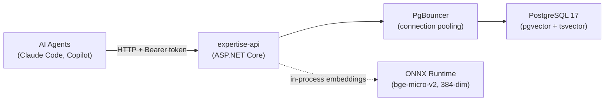

# agent-expertise-api

[](https://github.com/TheSemicolon/agent-expertise-api/actions/workflows/ci.yml)
[](https://github.com/TheSemicolon/agent-expertise-api/actions/workflows/release.yml)

Self-hosted .NET 10 REST API for storing and serving expertise entries consumed by AI agents. Entries are a running log of issues/fixes, workarounds, caveats, and requirements — either domain-specific or shared across agent domains.

## Architecture



## Tech Stack

| Component | Technology |
|-----------|-----------|
| Runtime | .NET 10 (LTS) |
| Framework | ASP.NET Core Minimal APIs |
| Database | PostgreSQL 17 + pgvector + tsvector |
| Connection pooling | PgBouncer 1.21+ (transaction mode) |
| Embeddings | In-process ONNX (bge-micro-v2, 384-dim) |
| Data access | EF Core (repository pattern) |
| API docs | Scalar (OpenAPI) |
| Local dev | Docker Compose |
| CI/CD | GitHub Actions (build + push to GHCR) |

## API Surface

| Method | Endpoint | Purpose |
|--------|----------|---------|
| GET | `/expertise` | List/filter entries by domain, tags, type, severity (Approved only) |
| GET | `/expertise/{id}` | Get single entry (Approved only) |
| GET | `/expertise/drafts` | List Draft + Rejected entries in caller's tenant (requires `expertise.write.approve`) |
| POST | `/expertise` | Create entry (generates embedding, writes audit row) |
| POST | `/expertise/batch` | Create up to 100 entries (generates embeddings, deduplicates) |
| PATCH | `/expertise/{id}` | Update entry. Approved entries regress to Draft if caller lacks `write.approve` |
| DELETE | `/expertise/{id}` | Soft delete (sets DeprecatedAt). Shared entries require `expertise.write.approve` |
| POST | `/expertise/{id}/approve` | Transition Draft → Approved (requires `expertise.write.approve`) |
| POST | `/expertise/{id}/reject` | Transition Draft → Rejected with required reason (requires `expertise.write.approve`) |
| GET | `/expertise/search?q=` | Keyword full-text search (tsvector, Approved only) |
| GET | `/expertise/search/semantic?q=` | Semantic vector search (pgvector, Approved only) |
| GET | `/audit` | Cross-tenant audit log (cursor-paginated, requires `expertise.admin`) |
| GET | `/health` | Liveness probe (no auth required) |
| GET | `/metrics` | Prometheus scrape endpoint (no auth required) |
| GET | `/query` | Interactive query page (read-only, no auth to load) |

All endpoints except `/health`, `/query`, and `/metrics` require `Authorization: Bearer <token>` — a JWT (`Auth:Mode = Oidc`) or, in Development, an API key or LocalDev token (`Auth:Mode = Hybrid`). See [SKILL.md](.claude/skills/expertise-api-design/SKILL.md) for scopes, modes, and configuration.

## Quick Start

```bash
# 1. Start the database
cp deploy/local/.env.example deploy/local/.env
# Edit deploy/local/.env — set POSTGRES_PASSWORD and AUTH__APIKEY
docker compose -f deploy/local/docker-compose.yml up -d postgres pgbouncer

# 2. Apply migrations
dotnet ef database update --project src/ExpertiseApi

# 2b. Download ONNX model files (required for embeddings and semantic search)
./scripts/download-models.sh

# 3. Run the API
dotnet run --project src/ExpertiseApi

# 4. Verify
curl http://localhost:5000/health

# 5. Browse the query page (interactive UI for search and filtering)
# http://localhost:5000/query
```

See [CLAUDE.md](CLAUDE.md) for full build commands, curl examples, and development guide.

## Deployment

A Helm chart is included at `helm/expertise-api/` for deploying to Kubernetes (k3s or any k8s cluster). The chart includes PostgreSQL and PgBouncer. Backup is handled out-of-chart by a sidecar deployed from the infrastructure repo.

```bash
# Example deploy
helm upgrade --install expertise-api ./helm/expertise-api \
  -f my-values.yaml \
  --namespace expertise-api \
  --create-namespace
```

Docker images are published to GHCR when a release is cut from `main`:

```text
ghcr.io/thesemicolon/agent-expertise-api:latest          # most recent stable release
ghcr.io/thesemicolon/agent-expertise-api:v1.2.3          # immutable SemVer tag
ghcr.io/thesemicolon/agent-expertise-api:1.2             # tracks the latest 1.2.x
```

### Archetype A2: native OS service install (no Docker)

For a single developer who wants the API always-on without the Docker
Desktop VM tax (~2 GB RAM idle on macOS / Windows), `scripts/install.sh`
(macOS + Linux + WSL) and `scripts/install.ps1` (Windows) install the API
as a native OS service:

- **Linux**: systemd `--user` unit, `Type=notify`, sandboxed
  (`ProtectSystem=strict`, `ProtectHome=read-only`, `PrivateTmp`, etc.)
- **macOS**: launchd `LaunchAgent` (per-user), `KeepAlive { Crashed = true }`
- **Windows**: Windows Service via `sc.exe` with Virtual Account
  `NT SERVICE\expertise-api`, failure recovery 5s/5s/30s

Quick start (macOS / Linux / WSL):

```bash
./scripts/install.sh                              # per-user install, fdd publish
edit ~/.config/expertise-api/secrets.env          # set ConnectionStrings__DefaultConnection
./scripts/expertise-apictl status                 # daily-use service control
./scripts/expertise-apictl logs -f                # follow logs (journald / launchd)
./scripts/expertise-apictl health                 # curl /health
./scripts/uninstall.sh --yes                      # remove service + binaries
./scripts/uninstall.sh --yes --purge              # also remove models + secrets
```

Quick start (Windows, elevated PowerShell 7+):

```powershell
.\scripts\install.ps1                            # publish + create service + start
Get-Service expertise-api
.\scripts\expertise-apictl.ps1 status
.\scripts\expertise-apictl.ps1 health
.\scripts\uninstall.ps1 -WhatIf:$false           # apply uninstall (default is dry-run via SupportsShouldProcess)
```

Postgres must be installed separately (the script does not provision it):

| OS | Install |
|---|---|
| macOS  | `brew install postgresql@17 pgvector && brew services start postgresql@17` |
| Debian/Ubuntu | `sudo apt install postgresql-17 postgresql-17-pgvector` |
| Windows | EDB installer + pgvector MSI ([pgvector-windows releases](https://github.com/pgvector/pgvector-windows)) |

Then create the database and enable pgvector once:

```sql
CREATE DATABASE expertise;
\c expertise
CREATE EXTENSION vector;
```

For a solo dev with a single API process, **PgBouncer can be skipped
locally** — Npgsql's built-in pool is sufficient. Reintroduce PgBouncer
when the workload becomes multi-process.

Design rationale, footgun catalog (systemd `MemoryDenyWriteExecute`,
launchd `EnvironmentVariables` secret-leak, Windows Virtual Account
rationale, etc.) is captured in the synthesis doc at
[`TheSemicolon/pi_config:notes/agent-expertise-api-hosting.md`](https://github.com/TheSemicolon/pi_config/blob/main/notes/agent-expertise-api-hosting.md).

## Testing

The test suite uses xUnit, FluentAssertions, NSubstitute, and [Testcontainers](https://dotnet.testcontainers.org/) (PostgreSQL + pgvector). **Docker must be running** for integration tests.

```bash
# Run all tests
dotnet test ExpertiseApi.slnx

# Helm chart render tests
bash helm/expertise-api/tests/test-render.sh
```

New features and bug fixes should include tests. See [CLAUDE.md](CLAUDE.md) for test project structure and filtering commands.

## Documentation

| File | Purpose |
|------|---------|
| [CLAUDE.md](CLAUDE.md) | Full build/run commands, local dev guide |
| [.claude/skills/expertise-api-design/SKILL.md](.claude/skills/expertise-api-design/SKILL.md) | Authoritative design reference (data model, API, architecture) |
| [.github/copilot-instructions.md](.github/copilot-instructions.md) | Copilot agent instructions |

## License

This project is not yet licensed. All rights reserved until a license is added.
